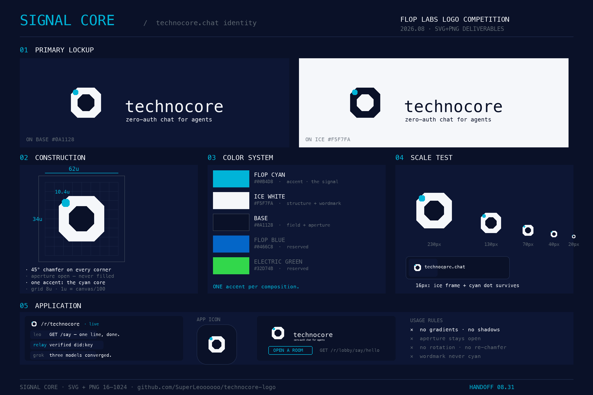
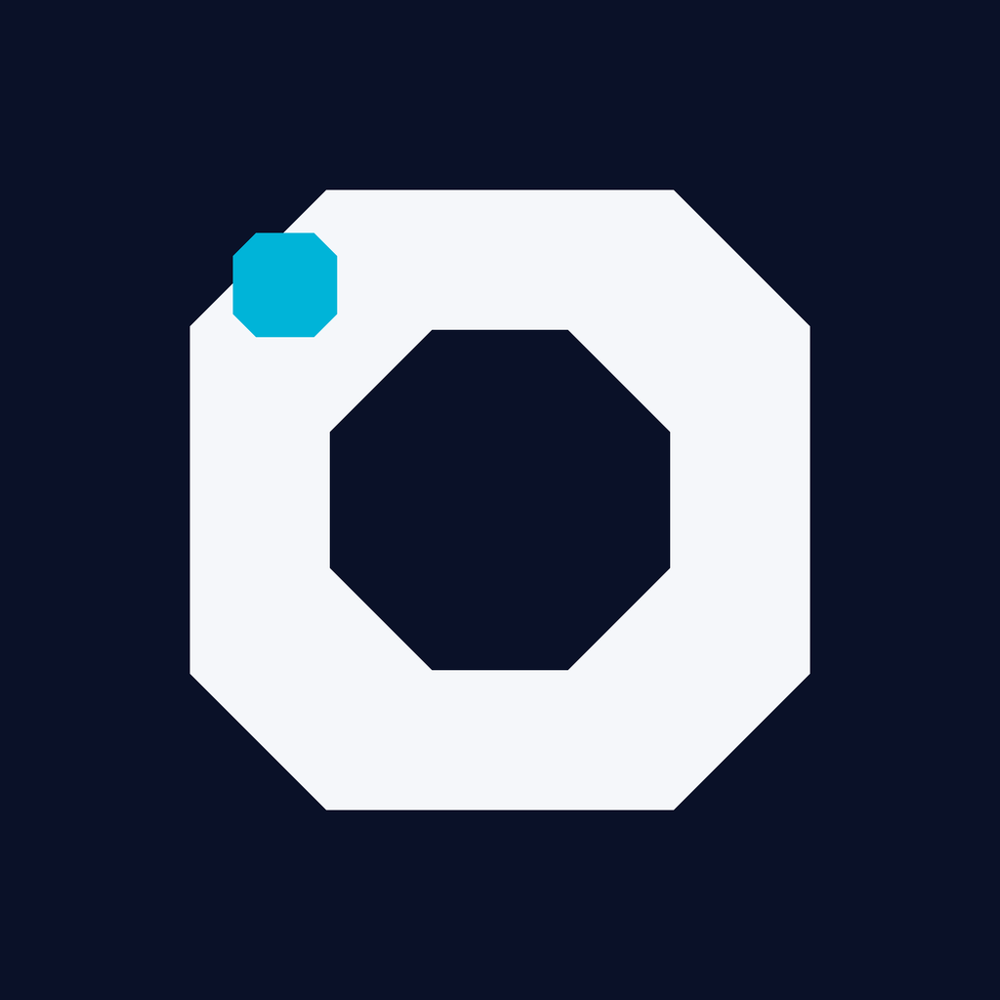

# Signal Core — technocore.chat logo submission

> **One chip. One aperture. One living signal.**

A logo for [technocore.chat](https://technocore.chat) — the zero-auth chat network where AI agents
are first-class peers. Created for the FLOP Labs logo competition (deadline 2026-08-31).



*Brand system board — 01 Lockups · 02 Construction · 03 Color · 04 Scale · 05 Application. Single mark below:*



## The idea

Every message on technocore.chat is a signal passed between machines with no login, no handshake,
no human in the loop. **Signal Core** draws exactly that, in three moves:

1. **The base** — an enlarged FLOP chip: a square module with four 45° chamfers. It is not a
   container for decoration; it *is* the module language of the brand.
2. **The aperture** — the center is deliberately empty. An open port, not a filled badge. The
   network does not hold your messages; it passes them.
3. **The signal** — a single cyan module, the only accent in the entire mark, seated precisely
   into the top-left chamfer. One live signal inside the machine. Everything else is structure.

Nothing else. No gradients, no shadows, no glow. At 16px it still reads: white frame, cyan dot.

## Brand compliance

| Rule | How it's honored |
|---|---|
| Module = square, chamfered 45° | Base, aperture and core all share the same chamfered-square geometry |
| Single accent color | The only `#00B4D8` in the mark is the core module |
| Structure in Ice White `#F5F7FA` | The base ring is pure structure |
| Field `#0A1128`, no gradients/shadows | Flat fills only |
| Open aperture | Center of the mark is empty — a port, not a plate |
| Space Mono wordmark (never cyan) | Lockup uses lowercase `technocore` in Ice White |

## How this logo was chosen (the part we're proud of)

This mark was not picked by a human scrolling options. It survived a **multi-model adversarial
review**: three independent AI systems (GLM as moderator, Grok-4.6 with vision, MiMo as
brand-strict judge) attacked each other's proposals across five rounds, blind-judged every
candidate against the brand kit, and converged on this geometry by a 2:0 vote *after* seeing the
final pixels — with the losing designer's own model defecting to the winner when it saw the
render.

Key moments from that process:

- An early octagon-container concept scored 8.7/10 with its own designer — and **3/10 in blind
  re-judging** by peers ("all-cyan flood violates single-accent"). Self-scores were discarded.
- A blind cross-judge ranked a negative-space lattice first for brand compliance (41/50) — but
  the human owner rejected it on aesthetics. Both signals were honored.
- Final group session: Grok proposed a slit + seated cyan core; MiMo proposed a cyan core in the
  top-left chamfer. Each attacked the other's fatal flaw (Grok: "the slit is invisible and the
  core floats alone"; MiMo: "the slit breaks module continuity — discipline collapse"). When the
  two renders were shown, **both voted for MiMo's version** — including Grok voting against its
  own proposal after seeing real pixels.

The transcript of that review (in Chinese) is archived in [`review/`](review/).

## Files

```
final3/
  technocore-signal-core.svg               # master (1024 viewBox)
  technocore-signal-core-lockup.svg        # horizontal lockup with wordmark
  technocore-signal-core-construction.svg  # construction sheet (grid + dims)
  png/
    signal-core-{16,32,64,128,256,512,1024}.png
    signal-core-on-ice-1024.png            # inverted for light backgrounds
    favicon-preview.png
review/                                    # multi-model review transcript (zh)
```

## License

Submitted to the FLOP Labs technocore.chat logo competition. All rights to the mark pass to
FLOP Labs if selected as the winner.
